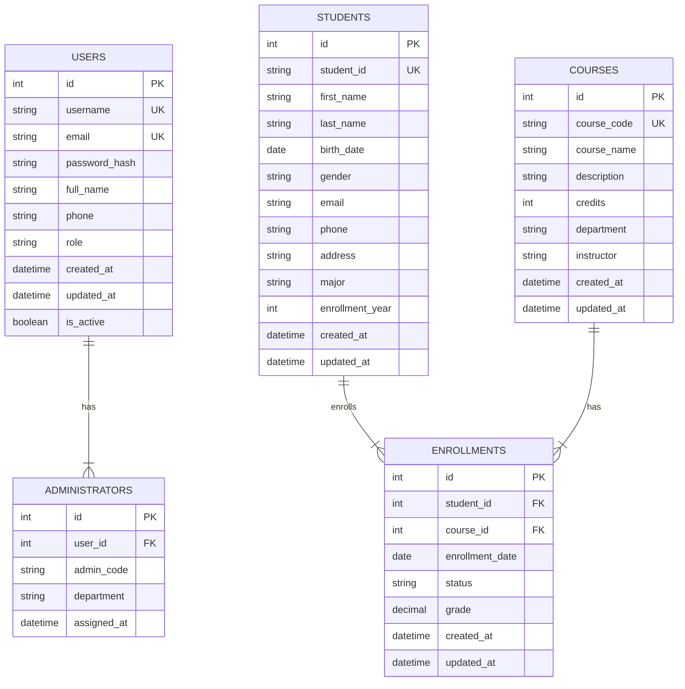

# 学生信息管理系统数据库设计

## ER图



## 表结构设计（满足第三范式）

### 1. users 表（用户表）
```sql
CREATE TABLE users (
    id INT PRIMARY KEY AUTO_INCREMENT,
    username VARCHAR(50) UNIQUE NOT NULL,
    email VARCHAR(100) UNIQUE NOT NULL,
    password_hash VARCHAR(255) NOT NULL,
    full_name VARCHAR(100) NOT NULL,
    phone VARCHAR(20),
    role ENUM('admin', 'student') NOT NULL DEFAULT 'student',
    created_at TIMESTAMP DEFAULT CURRENT_TIMESTAMP,
    updated_at TIMESTAMP DEFAULT CURRENT_TIMESTAMP ON UPDATE CURRENT_TIMESTAMP,
    is_active BOOLEAN DEFAULT TRUE
);
```

### 2. administrators 表（管理员表）
```sql
CREATE TABLE administrators (
    id INT PRIMARY KEY AUTO_INCREMENT,
    user_id INT UNIQUE NOT NULL,
    admin_code VARCHAR(50) UNIQUE NOT NULL,
    department VARCHAR(100),
    assigned_at TIMESTAMP DEFAULT CURRENT_TIMESTAMP,
    FOREIGN KEY (user_id) REFERENCES users(id) ON DELETE CASCADE
);
```

### 3. students 表（学生信息表）
```sql
CREATE TABLE students (
    id INT PRIMARY KEY AUTO_INCREMENT,
    student_id VARCHAR(20) UNIQUE NOT NULL,
    first_name VARCHAR(50) NOT NULL,
    last_name VARCHAR(50) NOT NULL,
    birth_date DATE,
    gender ENUM('Male', 'Female', 'Other'),
    email VARCHAR(100) UNIQUE NOT NULL,
    phone VARCHAR(20),
    address TEXT,
    major VARCHAR(100),
    enrollment_year INT,
    created_at TIMESTAMP DEFAULT CURRENT_TIMESTAMP,
    updated_at TIMESTAMP DEFAULT CURRENT_TIMESTAMP ON UPDATE CURRENT_TIMESTAMP
);
```

### 4. courses 表（课程表）
```sql
CREATE TABLE courses (
    id INT PRIMARY KEY AUTO_INCREMENT,
    course_code VARCHAR(20) UNIQUE NOT NULL,
    course_name VARCHAR(100) NOT NULL,
    description TEXT,
    credits INT NOT NULL DEFAULT 3,
    department VARCHAR(100),
    instructor VARCHAR(100),
    created_at TIMESTAMP DEFAULT CURRENT_TIMESTAMP,
    updated_at TIMESTAMP DEFAULT CURRENT_TIMESTAMP ON UPDATE CURRENT_TIMESTAMP
);
```

### 5. enrollments 表（选课表）
```sql
CREATE TABLE enrollments (
    id INT PRIMARY KEY AUTO_INCREMENT,
    student_id INT NOT NULL,
    course_id INT NOT NULL,
    enrollment_date DATE NOT NULL,
    status ENUM('enrolled', 'completed', 'dropped', 'withdrawn') DEFAULT 'enrolled',
    grade DECIMAL(5,2),
    created_at TIMESTAMP DEFAULT CURRENT_TIMESTAMP,
    updated_at TIMESTAMP DEFAULT CURRENT_TIMESTAMP ON UPDATE CURRENT_TIMESTAMP,
    UNIQUE KEY unique_enrollment (student_id, course_id),
    FOREIGN KEY (student_id) REFERENCES students(id) ON DELETE CASCADE,
    FOREIGN KEY (course_id) REFERENCES courses(id) ON DELETE CASCADE
);
```

## 第三范式说明

1. **第一范式 (1NF)**：所有字段都是原子性的，不可再分
2. **第二范式 (2NF)**：所有非主键字段完全依赖于主键
3. **第三范式 (3NF)**：消除了传递依赖，非主键字段不依赖于其他非主键字段

例如：
- `administrators` 表通过 `user_id` 外键关联 `users` 表，避免了直接存储用户信息的冗余
- `enrollments` 表使用外键关联 `students` 和 `courses`，避免了重复存储学生和课程信息